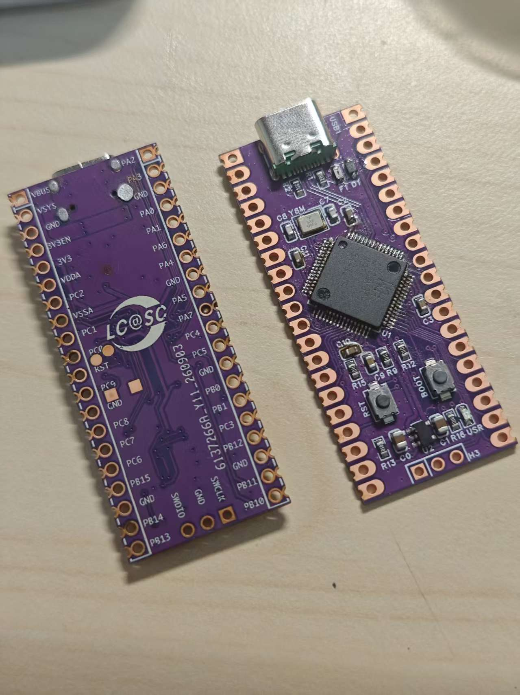
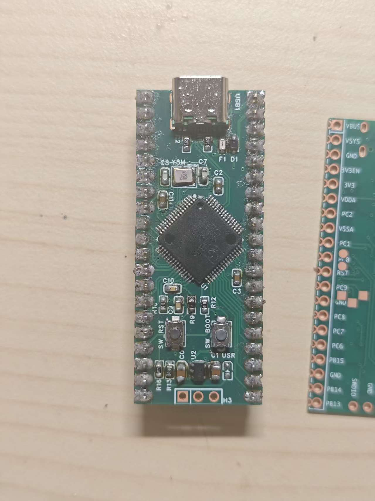
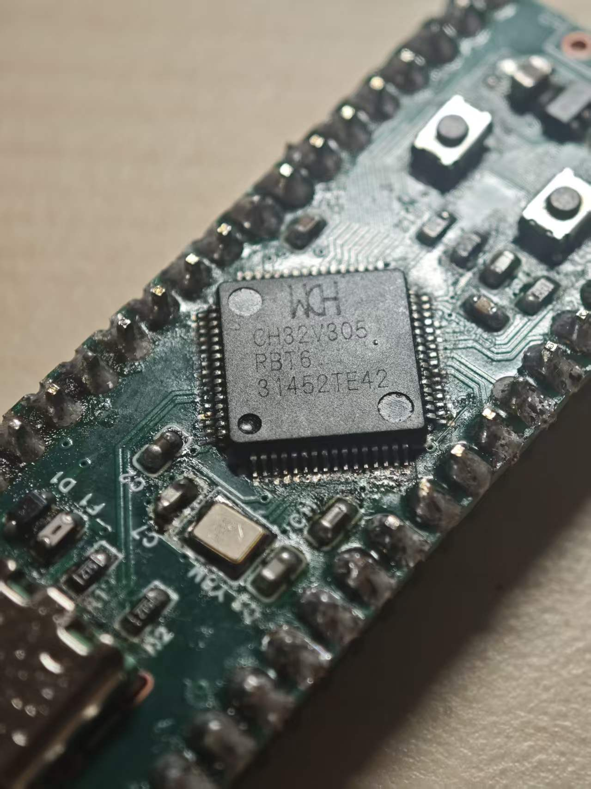
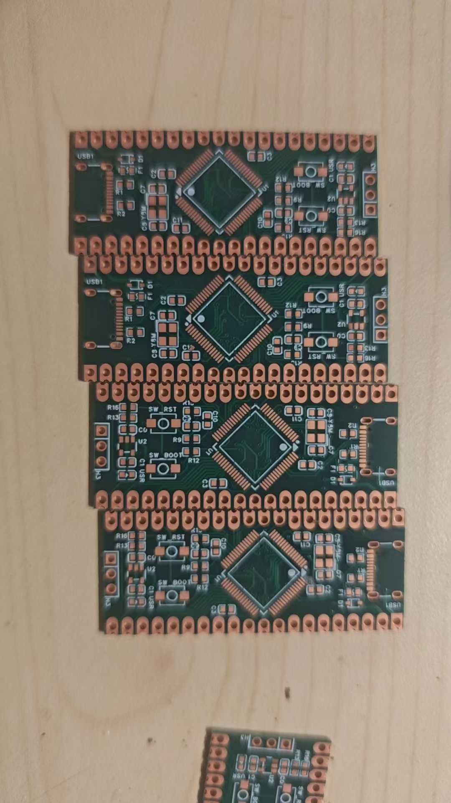

# ch32v305-pico

This project is licensed under the GNU General Public License v3.0 or later;
see [LICENSE](LICENSE).

A compact CH32V305RBT6 development board with Raspberry Pi Pico-compatible
dimensions and castellated holes. It supports USB High Speed and provides ample
GPIO and ADC resources, making it well suited to projects such as keyboards
with an 8 kHz polling rate. All passive components are 0603 or larger for easy
hand soldering. The repository also includes a proven CherryUSB port and
ready-to-use demos.

The board can be reproduced for approximately ¥15/$2. Rev 2 uses a two-layer
PCB to reduce manufacturing costs for volume production. The original Rev 1
used a four-layer PCB; its low-cost prototype relied on JLCPCB's free four-layer
PCB offer without a special castellated-hole requirement.

## Hardware

### Rev 2 — 2026-09-17

Rev 2 changes the PCB from four layers to two layers to lower manufacturing
costs for volume production.

- [EDA project](pcb/v2/ProPrj_ch32v305_pico.epro)
- [Gerber and drill files](pcb/v2/ch32v305_pico_rev2_2026-09-17.zip)
- [Hardware changelog](pcb/CHANGELOG)

<p align="center">
  
</p>

Used utensil this time. The soldering is much better now.

### Rev 1 — 2026-08-29

The initial four-layer hardware validation revision, with basic power-supply
operation and USB High Speed connectivity and communication validated.
Design and manufacturing files are available in [pcb/v1](pcb/v1).

<p align="center">
  
  
  
</p>

See [the pin layout and alternate-function diagram](docs/pin-mode.md). Sorry for
the poor soldering job. 😂 Special thanks to JLCPCB for free prototyping.

## CherryUSB / USBHS

The repository includes a reusable CH32V30x CherryUSB port derived from the
upstream CH32V307 implementation. See
[CherryUSB USBHS configuration](docs/cherryusb-usbhs.md) for source attribution,
local fixes, and MounRiver project setup.

Known limitation: the CH32 USBHS device-controller port defaults to 16
bidirectional endpoint numbers and statically reserves a 512-byte OUT plus a
512-byte IN DMA buffer for every non-control endpoint. This consumes about
15 KiB of SRAM even when most endpoints are unused. Small-RAM projects should
define `USB_NUM_BIDIR_ENDPOINTS` to one more than the highest endpoint number
they actually use; see the linked configuration document for details.

## Development guide

There are two straightforward ways to build and program the examples.

### Command-line workflow

1. Download and install the RISC-V compiler from the official
   [WCH ToolKit](https://www.wch.cn/downloads/WCHToolKit_ZIP.html), or use the
   toolchain bundled with MounRiver Studio. The Makefiles expect commands named
   `riscv-none-embed-gcc`, `riscv-none-embed-objcopy`, and
   `riscv-none-embed-size`.
2. Clone the official [CH32V307 EVT repository](https://github.com/openwch/ch32v307).
   It supplies the CH32V30x device headers, peripheral drivers, startup code,
   system initialization, and linker scripts used by these examples.
3. Build an example, pointing `WCH_EVT_ROOT` at its `EVT` directory:

   ```sh
   git clone https://github.com/openwch/ch32v307.git ../ch32v307
   make -C examples/blink WCH_EVT_ROOT="$(pwd)/../ch32v307/EVT"
   ```

   If the compiler is not in `PATH`, also pass
   `TOOLCHAIN_BIN=/path/to/toolchain/bin`. On macOS, the Makefiles automatically
   detect the default MounRiver Studio 2 toolchain location. The resulting
   `.elf`, `.bin`, and `.map` files are placed in the example's `build/`
   directory.
4. Install the open-source [wchisp](https://github.com/ch32-rs/wchisp) USB/UART
   ISP tool (for example, `cargo install wchisp --force`). To put this board
   into ISP mode, either hold **BOOT** while applying power, or hold both
   **BOOT** and **RESET** while the board is powered, then release **RESET**
   before releasing **BOOT**. Connect its USB port and program the ELF directly:

   ```sh
   wchisp info
   wchisp flash examples/blink/build/blink.elf
   ```

`wchisp` talks to the MCU's built-in USB/UART ISP bootloader; it is not a
WCH-Link flashing or debugging tool.

### MounRiver Studio workflow

Alternatively, development can be done entirely in MounRiver Studio. Create a
CH32V305/CH32V307 project (an EVT example is a useful starting point), add the
desired sources from this repository, and copy the corresponding include
paths, device definition, startup file, and linker settings from its Makefile.
Then use MounRiver Studio to build, flash, and debug through WCH-Link. USBHS
projects also need the CherryUSB sources and project settings described in
[CherryUSB USBHS configuration](docs/cherryusb-usbhs.md).

## Examples

- [PA8 breathing LED](examples/blink/README.md): drives the onboard user LED
  with TIM1_CH1 hardware PWM and a perceptual brightness curve.
- [CH32V305 USBHS internal-Flash MSC disk](examples/usbhs_udisk/README.md):
  reserves the final 8 KiB of a CH32V305RBT6 as a persistent FAT12 test disk.
- [USBHS eight-channel logic analyzer](examples/usbhs_logic_analyzer/README.md):
  samples PA0–PA7 through timer-triggered DMA and speaks the SUMP/OLS protocol
  used by PulseView and sigrok.
- [CH32V305 Pico logic-pattern generator](examples/ch32v305_logic_generator/README.md):
  outputs counter, walking-one, alternating, LFSR, and pulse patterns on PA0–PA7.
- [CH32V305 Pico protocol generator](examples/ch32v305_protocol_generator/README.md):
  produces 3.3 V UART, SPI, synthetic I2C, PWM, and variable-width pulse signals.
  See the [two-board demo guide](docs/two-board-demo.md) for shared wiring and
  PulseView settings; use a second Pico as the analyzer.
