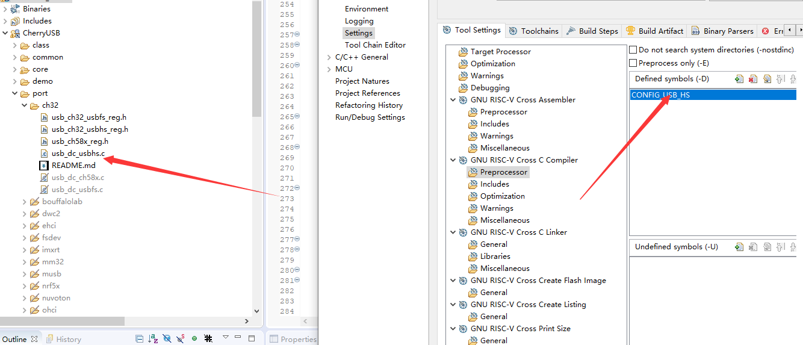

# CherryUSB and USBHS Project Configuration

## Upstream implementation

The CH32V307 CherryUSB implementation was originally sourced from
`crl6/cherryusb_ch32v307`:

- Upstream repository: <https://github.com/crl6/cherryusb_ch32v307>
- Original CherryUSB directory: <https://github.com/crl6/cherryusb_ch32v307/tree/a017bee289f4fdfcdbba8bf59a76fdfc973875b5/CherryUSB>
- Source commit: [`a017bee289f4fdfcdbba8bf59a76fdfc973875b5`](https://github.com/crl6/cherryusb_ch32v307/commit/a017bee289f4fdfcdbba8bf59a76fdfc973875b5)

This project retains and consolidates general-purpose fixes made on top of that
implementation, including Chapter 9 configuration lifecycle handling,
multi-byte HID reports, USBHS EP0 data toggles, endpoint halt/close behavior,
controller reset, and suspend/resume handling.

## Generalization in this repository

After the port was imported from ProShock 4, logic tied to a specific gamepad
main loop and its 8 kHz report scheduling was removed:

- Periodic calls to `usb_dc_usbhs_service()` are no longer required; that API
  and the EP0 priority watchdog have been removed. Non-control IN endpoints are
  never paused merely because a SETUP packet arrived.
- The application-level recovery API for missing IN completions and the public
  USBHS IRQ lock/unlock API have been removed.
- The EP0 request-complete callback used by WebHID/DS4 has been removed.
- The temporary `PROSHOCK_USBHS_FORCE_FULL_SPEED` diagnostic switch has been removed.
- USB suspend/resume events are still delivered to classes through the standard
  CherryUSB event mechanism, but no project-specific status API is exposed.

Multi-byte HID `GET_REPORT`/`SET_REPORT` support is a general HID capability, so
it is retained and consistently uses `usbd_hid_*` device callback names. The
default `SET_REPORT` handler acknowledges the request, preventing ordinary
keyboard examples without an LED output callback from stalling the control
endpoint. Applications that need report validation can provide a strong
definition of the same callback and return a negative value to reject a request.

The device core tracks the current alternate setting separately for every
interface. When changing configurations, processing `SET_INTERFACE`, or
processing `SET_CONFIGURATION(0)`, it operates only on endpoints belonging to
the current configuration and alternate setting.

Currently, `usb_dc_deinit()` only disconnects and resets the USBHS controller;
it still does not call `usb_dc_low_level_deinit()`. Projects that need to turn
off the USBHS clock, PHY, or NVIC at runtime must handle that in their board-level
lifecycle code. This generalization does not change the existing behavior.

## Known implementation limitation: fixed endpoint SRAM allocation

`CherryUSB/port/ch32/usb_dc_usbhs.c` defines `USB_NUM_BIDIR_ENDPOINTS` as 16 by
default and statically reserves a 512-byte OUT buffer plus a 512-byte IN DMA
buffer for every non-control endpoint in `g_ch32_usbhs_udc`:

```c
uint8_t ep_databuf[USB_NUM_BIDIR_ENDPOINTS - 1][512 + 512];
```

With the default configuration, endpoint data buffers alone consume 15 KiB of
SRAM. `usb_dc_init()` also iterates over all of these endpoints to configure
their RX/TX DMA addresses. Omitting an endpoint from the USB descriptors or not
opening it at runtime does not eliminate its static RAM allocation. On a
CH32V305 with only 32 KiB of SRAM, this can easily crowd out application buffers,
protocol stacks, and stack space.

Override the macro in the project's `usb_config.h` with the highest endpoint
number actually used, plus one. For example, an MSC device using EP0, `0x82 IN`,
and `0x03 OUT` has a highest endpoint number of 3:

```c
#define USB_NUM_BIDIR_ENDPOINTS 4
```

This reserves buffers only for EP1 through EP3, reducing endpoint storage from
about 15 KiB to about 3 KiB. Do not set the macro merely to the number of
endpoints in use: if `0x84` is used, the value must be at least 5 even when it is
the only non-control endpoint, or the endpoint state and DMA buffer arrays will
be accessed out of bounds. This limitation comes from the CH32 USBHS port's
current compile-time static allocation, not from a general CherryUSB class-layer
requirement.

## Enabling USBHS in MounRiver Studio

The screenshot below shows the key project settings: select `usb_dc_usbhs.c`
and define `CONFIG_USB_HS` in the C compiler's Preprocessor settings.



Configure the project as follows:

1. Add the repository's top-level `CherryUSB` directory to the MounRiver
   project. It may be copied directly into the project or referenced through an
   Eclipse linked resource.
2. Add `CONFIG_USB_HS` to `Defined symbols (-D)` under `Project Properties ->
   C/C++ Build -> Settings -> GNU RISC-V Cross C Compiler -> Preprocessor`. The
   equivalent command-line option is `-DCONFIG_USB_HS`.
3. Add at least the following header search paths:

   ```text
   CherryUSB
   CherryUSB/common
   CherryUSB/core
   CherryUSB/class/<class-in-use>
   CherryUSB/port/ch32
   ```

4. A device project must compile at least `CherryUSB/core/usbd_core.c`, the
   source files for the class in use, and `CherryUSB/port/ch32/usb_dc_usbhs.c`.
   Do not compile `usb_dc_usbfs.c`, `usb_dc_ch58x.c`, or another
   device-controller port in the same project; doing so can cause duplicate
   API/IRQ definitions or select the wrong controller.
5. `usb_dc_usbhs.c` provides weak definitions of `usb_dc_low_level_init()` and
   `usb_dc_low_level_deinit()`. Board code should provide strong definitions to
   initialize the USBHS clock, PHY, and IRQ. The original reference project used
   the following configuration with an external HSE:

   ```c
   void usb_dc_low_level_init(void)
   {
       RCC_USBCLK48MConfig(RCC_USBCLK48MCLKSource_USBPHY);
       RCC_USBHSPLLCLKConfig(RCC_HSBHSPLLCLKSource_HSE);
       RCC_USBHSConfig(RCC_USBPLL_Div2);
       RCC_USBHSPLLCKREFCLKConfig(RCC_USBHSPLLCKREFCLK_4M);
       RCC_USBHSPHYPLLALIVEcmd(ENABLE);
       RCC_AHBPeriphClockCmd(RCC_AHBPeriph_USBHS, ENABLE);
       NVIC_EnableIRQ(USBHS_IRQn);
   }
   ```

   The PLL source, divider, and reference frequency must match the board's
   actual HSE and system clock configuration. Do not copy these settings
   unchanged to a board with a different clock source.
6. USBHS uses the chip's HS PHY and USBHS pins. The PCB must route the
   corresponding D+/D- pins to the USB connector; defining `CONFIG_USB_HS`
   cannot turn hardware connected to the USBFS/OTG_FS pins into USBHS.
7. Complete board-level clock initialization before registering CherryUSB
   descriptors/classes and calling `usbd_initialize()`. Endpoint maximum packet
   sizes and intervals in high-speed descriptors must also match the actual
   class and target polling rate; changing only the build macro is insufficient.

## Quick checks

- Run `tests/run_cherryusb_tests.sh` after changing the device core, HID/MSC
  classes, or CH32 USBHS port; the host-side suite treats warnings as errors.
- The compiler command line contains `-DCONFIG_USB_HS`.
- Exactly one CH32 device-controller port, `usb_dc_usbhs.c`, is linked into the
  final image.
- The map file contains `USBHS_IRQHandler` and reports no duplicate definition.
- `usb_dc_low_level_init()` uses the board's clock configuration and enables
  `USBHS_IRQn`.
- Host enumeration reports the intended speed and descriptors. If the device
  enumerates only at Full Speed, check the PHY clock, D+/D- pins and routing,
  cable, and descriptors before adding more build macros.
