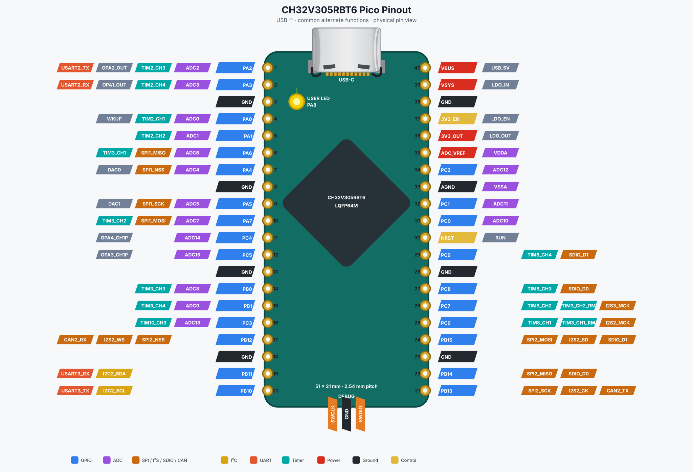

# CH32V305 Pico pin layout

本板采用 Raspberry Pi Pico 的 51 × 21 mm 外形、双排 20 Pin、2.54 mm 间距和 17.78 mm 排距。下图以 **USB-C 朝上** 为准：左排由上至下为 Pin 1→20，右排由上至下为 Pin 40→21。

> 这是机械布局和常用接口语义兼容方案，不是 RP2040 的软件级兼容方案。CH32V305 的复用功能受 AFIO remap 配置影响；图中列出的是本板推荐使用的常用功能，不代表数据手册中的所有复用组合。



## 40 Pin 定义

| Pico Pin | 板上信号 | MCU脚 | 常用复用功能 |
|---:|---|---:|---|
| 1 | PA2 | 16 | ADC2、USART2_TX、TIM2_CH3、OPA2_OUT |
| 2 | PA3 | 17 | ADC3、USART2_RX、TIM2_CH4、OPA1_OUT |
| 3 | GND | — | 数字地 |
| 4 | PA0 | 14 | ADC0、WKUP、TIM2_CH1 |
| 5 | PA1 | 15 | ADC1、TIM2_CH2 |
| 6 | PA6 | 22 | ADC6、SPI1_MISO、TIM3_CH1 |
| 7 | PA4 | 20 | ADC4、DAC0、SPI1_NSS |
| 8 | GND | — | 数字地 |
| 9 | PA5 | 21 | ADC5、DAC1、SPI1_SCK |
| 10 | PA7 | 23 | ADC7、SPI1_MOSI、TIM3_CH2 |
| 11 | PC4 | 24 | ADC14、OPA4_CH1P |
| 12 | PC5 | 25 | ADC15、OPA3_CH1P |
| 13 | GND | — | 数字地 |
| 14 | PB0 | 26 | ADC8、TIM3_CH3 |
| 15 | PB1 | 27 | ADC9、TIM3_CH4 |
| 16 | PC3 | 11 | ADC13、TIM10_CH3 |
| 17 | PB12 | 33 | SPI2_NSS、I2S2_WS、CAN2_RX |
| 18 | GND | — | 数字地 |
| 19 | PB11 | 30 | I2C2_SDA、USART3_RX |
| 20 | PB10 | 29 | I2C2_SCL、USART3_TX |
| 21 | PB13 | 34 | SPI2_SCK、I2S2_CK、CAN2_TX |
| 22 | PB14 | 35 | SPI2_MISO、SDIO_D0¹ |
| 23 | GND | — | 数字地 |
| 24 | PB15 | 36 | SPI2_MOSI、I2S2_SD、SDIO_D1¹ |
| 25 | PC6 | 37 | TIM8_CH1、TIM3_CH1 remap、I2S2_MCK |
| 26 | PC7 | 38 | TIM8_CH2、TIM3_CH2 remap、I2S3_MCK |
| 27 | PC8 | 39 | TIM8_CH3、SDIO_D0 |
| 28 | GND | — | 数字地 |
| 29 | PC9 | 40 | TIM8_CH4、SDIO_D1 |
| 30 | NRST | 7 | Pico RUN语义，低电平复位 |
| 31 | PC0 | 8 | ADC10；对应 Pico ADC0 的物理位置 |
| 32 | PC1 | 9 | ADC11；对应 Pico ADC1 的物理位置 |
| 33 | AGND | 12 | VSSA，模拟地 |
| 34 | PC2 | 10 | ADC12；对应 Pico ADC2 的物理位置 |
| 35 | ADC_VREF | 13 | VDDA，本板直接接3V3 |
| 36 | 3V3_OUT | — | AP2112K-3.3输出；不允许外部倒灌 |
| 37 | 3V3_EN | — | AP2112K EN，100 kΩ上拉至VSYS；拉低关断 |
| 38 | GND | — | 电源地 |
| 39 | VSYS | — | LDO输入，目标范围3.6–5.5 V |
| 40 | VBUS | — | USB-C 5 V，经保险丝前的VBUS节点 |

¹ SDIO 功能及映射条件应以实际芯片批次对应的数据手册和 AFIO 配置为准。

## 推荐的连续接口组

- 主串口：Pin 1 `PA2/USART2_TX` + Pin 2 `PA3/USART2_RX`。
- SPI1：Pin 7 `PA4/NSS`、Pin 9 `PA5/SCK`、Pin 6 `PA6/MISO`、Pin 10 `PA7/MOSI`。
- 主 I²C：Pin 20 `PB10/I2C2_SCL` + Pin 19 `PB11/I2C2_SDA`。
- SPI2：Pin 17 `PB12/NSS`、Pin 21 `PB13/SCK`、Pin 22 `PB14/MISO`、Pin 24 `PB15/MOSI`。
- Pico 模拟区：Pin 31/32/34 分别为 `ADC10/11/12`，Pin 33 为 `AGND`，Pin 35 为 `ADC_VREF/VDDA`。

所有 ADC 输入都不得超过 VDDA 或低于 VSSA；ADC 引脚不要按“5 V容忍数字输入”使用。

## 板内扩展焊盘

外排优先保留了全部16路ADC，其余GPIO可放在板内测试焊盘或0.5/1.0 mm FPC连接器：

| 用途 | MCU GPIO（物理脚） |
|---|---|
| 板载用户LED | PA8/41，固件应按实际LED有效电平驱动 |
| WCH-Link / SWD | 底部三针从左到右为 PA14/49 SWCLK、GND、PA13/46 SWDIO |
| USBFS备用 | PA11/44 USB1DM、PA12/45 USB1DP |
| 高速/串口扩展 | PA9/42、PA10/43、PA15/50 |
| SPI3 / SDIO | PC10/51、PC11/52、PC12/53、PD2/54、PB3/55、PB4/56、PB5/57 |
| I2C1 | PB8/61 SCL、PB9/62 SDA |
| RTC / LSE | PC13/2、PC14/3、PC15/4 |
| 启动 | PB2/28 BOOT1、BOOT0/60 |

USBHS 使用 PB6/58 `USBHS_DM` 与 PB7/59 `USBHS_DP`，只允许非常短、无支路的测试焊盘；不要引到普通排针。

## 重新生成引脚图

引脚图由仓库内的小型 Python 脚本生成，无第三方依赖：

```sh
python3 tools/render_pinout.py
```

检查已提交的 SVG 是否和脚本数据一致：

```sh
python3 tools/render_pinout.py --check
```

修改引脚分配时，应同时更新 `tools/render_pinout.py` 中的 `PINS` 和本页表格，然后重新生成 `docs/assets/pinout.svg`。
